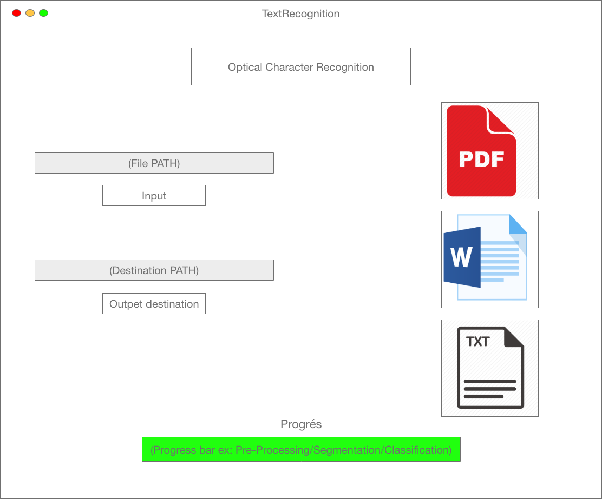

# Handwritten Text Recognition
School project about building an HTR desktop app from scratch.

## Contributors
- MERZOUGUI Dhia
- MERCIER Julien
- TIREAU Thoams

## Dependencies
This is a 4 year old project at this point. It was last tested with very old versions of the libraries.

- PyQt5 (v5.11.3)
- Tensorflow (v1.12.0)
- OpenCV (v4.0.0.21)
- Numpy (v1.16)
- fpdf
- python-docx
- Matplotlib
- editdistance
- Python 3.6.8

## Screenshot

